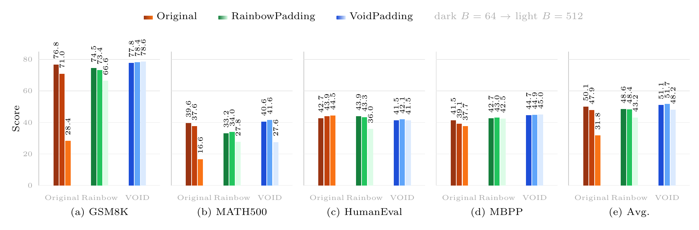
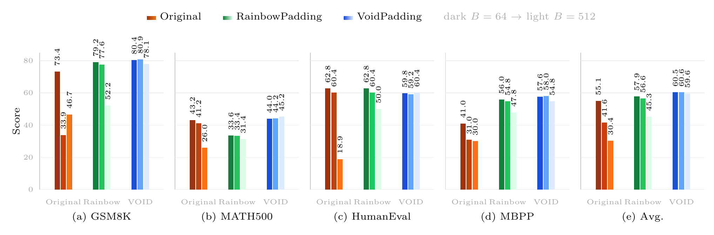
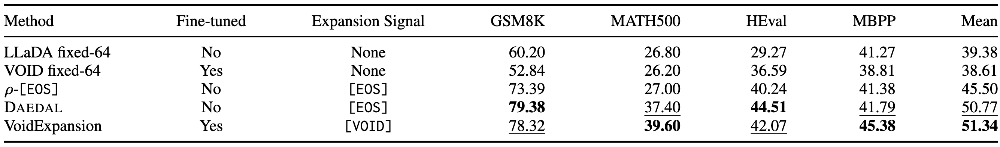
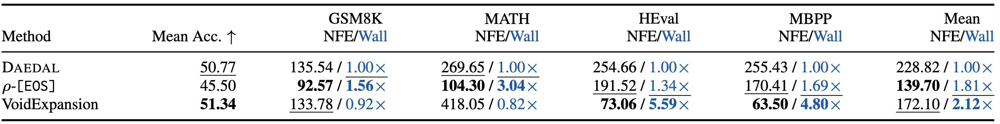

# VoidPadding : Let `[VOID]` handle padding in masked diffusion language models so that `[EOS]` can focus on semantic termination.

[](https://arxiv.org/abs/2606.17999)
[](https://huggingface.co/datasets/akpon900/Tokenized_VoidPadding_Data)
[](https://huggingface.co/akpon900/dream-instruct-void)
[](https://huggingface.co/akpon900/llada-instruct-void)

<p align="center">
  
</p>

> **「假作真時真亦假，無為有處有還無。」 —《紅樓夢》太虛幻境**

In MDLMs, repeated padding can blur the boundary between emptiness and ending. This ambiguity can cause `[EOS]` overflow, a common failure mode where the model overproduces `[EOS]` under large-block decoding.

**VoidPadding** decouples padding from termination: `[VOID]` represents padded emptiness, while `[EOS]` marks semantic endings. By separating these signals, VoidPadding mitigates `[EOS]` overflow under large-block decoding, while using `[VOID]` as a learned length signal for adaptive canvas expansion.


## Method


**VoidPadding** uses `[VOID]` for padding and reserves `[EOS]` for semantic
termination in masked diffusion language models. At inference, `[VOID]`
generation is banned.

This gives VoidPadding three practical advantages:

- **Prevents EOS overflow.**
- **Makes `[EOS]` a reliable terminator,** enabling more efficient decoding with
  less wasted generation.
- **Enables VOID-based canvas expansion** by using the learned `[VOID]` signal
  to detect when the current response canvas is too short.

## Main Results

Our main experiments evaluate VoidPadding on **LLaDA-8B-Instruct** and **Dream-7B-Instruct**, where it improves fixed-length robustness and short-canvas expansion. Additional scripts are provided to reproduce the appendix experiments on **LLaDA-8B-Base** and **Dream-7B-Base**.


### Fixed-Length Evaluation

We evaluate fixed-length robustness and efficiency with generation length fixed to 512 and block size varied over 64, 128, and 512. Darker bars denote smaller blocks, and the Avg. panel reports the mean over GSM8K, MATH500, HumanEval, and MBPP. VoidPadding achieves block-averaged Avg. gains of +7.06/+3.59 on LLaDA and +17.84/+6.95 on Dream over Original/RainbowPadding.


#### LLaDA



#### Dream



For efficiency, we report the NFE reduction of VoidPadding relative to Original/RainbowPadding, averaged over block sizes 64, 128, and 512.

| Backbone | GSM8K | MATH500 | HumanEval |  MBPP |  Avg. |
| -------- | ----: | ------: | --------: | ----: | ----: |
| LLaDA    | 75.0% |   13.5% |     80.4% | 86.4% | 63.8% |
| Dream    | 69.3% |   27.5% |     41.3% | 84.6% | 55.7% |


### Short-Canvas Expansion

All methods in this section use an initial response canvas length of 64 and a decoding block size of 32.

#### LLaDA

DAEDAL and rho-[EOS] are inference-only variable-length generation baselines whose released implementations support LLaDA, so we compare them on LLaDA. VoidExpansion achieves the best mean score, improving over Fixed-64 by +11.96, over rho-[EOS] by +5.84, and over DAEDAL by +0.57.



VoidExpansion also reduces average NFE from 228.82 to 172.10 relative to DAEDAL, with a 2.12× mean wall-clock speedup.



#### Dream

For Dream, we compare the Fixed-64 baseline with VoidExpansion. VoidExpansion improves the mean score from 42.23 to 60.37, a gain of +18.14.

| Method        | GSM8K | MATH500 | HumanEval |  MBPP |  Mean |
| ------------- | ----: | ------: | --------: | ----: | ----: |
| Fixed-64      | 53.22 |   22.80 |     43.90 | 49.00 | 42.23 |
| VoidExpansion | 79.08 |   44.00 |     60.98 | 57.40 | 60.37 |


## What Is Included

```text
├── main.py                         # LoRA SFT entrypoint
├── method/                         # Void/Rainbow/EOS padding training logic
├── eval/                           # LLaDA and Dream lm-eval wrappers
│   ├── dream/
│   ├── llada/
│   └── common/tasks/               # MATH500 and MBPP task configs/utilities
├── scripts/
│   ├── setup_env.sh                # One-command conda environment setup
│   ├── train/                      # SFT launch scripts
│   ├── merge/                      # Merge PEFT LoRA adapters into base models
│   └── eval/                       # Fixed-length and expansion evaluation
├── tokenizer_dream/                # Dream tokenizer assets used by eval/merge
├── tokenizer_llada/                # LLaDA tokenizer assets used by eval/merge
├── models/                         # Optional local adapter download directory
├── figures/                        # README figures
└── environment.yaml                # Conda environment
```

Runtime outputs are intentionally ignored by git:

- `model/` local training checkpoints
- `outputs/` merged test outputs, generated samples, SwanLab logs
- `logs/` runtime logs
- `evals_results/` benchmark outputs
- `models/` local adapter downloads
- `.hf_cache/` and Python caches

## Quick Start

Create the environment:

```bash
bash scripts/setup_env.sh
conda activate void
```

Use a custom environment name:

```bash
ENV_NAME=void-padding bash scripts/setup_env.sh
conda activate void-padding
```

The setup script creates or updates the conda environment and verifies the core
packages: PyTorch, Transformers, PEFT, and lm-eval.

HumanEval and MBPP post-processing is enabled by default in the eval scripts:
`postprocess_code.py` runs after HumanEval, and `postprocess_mbpp.py` runs
after MBPP. Set `POSTPROCESS_CODE=false` or `POSTPROCESS_MBPP=false` to skip
those steps.

## Data and Checkpoints

### Tokenized SFT Data

The tokenized SFT data is released at:

```text
akpon900/Tokenized_VoidPadding_Data
```

Expected structure after download:

```text
datasets/
├── tokenized_sft_dataset_dream_500000/
└── tokenized_sft_dataset_llada_500000/
```

Download with the Hugging Face CLI:

```bash
hf download akpon900/Tokenized_VoidPadding_Data \
  --repo-type dataset \
  --local-dir datasets
```

Then set `SFT_CACHE_DIR` before training:

```bash
# Dream training
export SFT_CACHE_DIR="$PWD/datasets/tokenized_sft_dataset_dream_500000"

# LLaDA training
export SFT_CACHE_DIR="$PWD/datasets/tokenized_sft_dataset_llada_500000"
```

### Base Models

VoidPadding adapters are LoRA adapters and must be used with their original base
models.

Dream base model:

```bash
hf download Dream-org/Dream-v0-Instruct-7B \
  --local-dir pretrained/Dream-v0-Instruct-7B
```

LLaDA base model:

```bash
hf download GSAI-ML/LLaDA-8B-Instruct \
  --local-dir pretrained/LLaDA-8B-Instruct
```

You can pass either the Hugging Face model id or the local download directory to
the merge/eval scripts:

```bash
BASE_MODEL="Dream-org/Dream-v0-Instruct-7B"
BASE_MODEL="pretrained/Dream-v0-Instruct-7B"
```

For base-model training experiments, use:

```bash
hf download Dream-org/Dream-v0-Base-7B \
  --local-dir pretrained/Dream-v0-Base-7B

hf download GSAI-ML/LLaDA-8B-Base \
  --local-dir pretrained/LLaDA-8B-Base
```

### Released LoRA Adapters

Released adapter repositories:

```text
akpon900/dream-instruct-rainbow
akpon900/dream-instruct-void
akpon900/llada-instruct-rainbow
akpon900/llada-instruct-void
```

Download them with:

```bash
hf download akpon900/dream-instruct-void \
  --local-dir models/dream-instruct-void

hf download akpon900/dream-instruct-rainbow \
  --local-dir models/dream-instruct-rainbow

hf download akpon900/llada-instruct-void \
  --local-dir models/llada-instruct-void

hf download akpon900/llada-instruct-rainbow \
  --local-dir models/llada-instruct-rainbow
```

If you download the adapters into `models/`, the local layout should be:

```text
models/
├── dream-instruct-void/
├── dream-instruct-rainbow/
├── llada-instruct-void/
└── llada-instruct-rainbow/
```

Each adapter repository contains:

- `README.md`
- `adapter_config.json`
- `adapter_model.safetensors`


## Merge LoRA Adapters

Evaluation expects merged full-model checkpoints. Merge a Dream adapter:

```bash
BASE_MODEL="Dream-org/Dream-v0-Instruct-7B" \
ADAPTER_PATH="models/dream-instruct-void" \
OUTPUT_DIR="outputs/merged/dream-instruct-void" \
bash scripts/merge/merge_dream_lora.sh
```

Merge a LLaDA adapter:

```bash
BASE_MODEL="GSAI-ML/LLaDA-8B-Instruct" \
ADAPTER_PATH="models/llada-instruct-void" \
OUTPUT_DIR="outputs/merged/llada-instruct-void" \
bash scripts/merge/merge_llada_lora.sh
```

Useful overrides:

```bash
TORCH_DTYPE=bfloat16
DEVICE=cuda          # auto, cpu, cuda, or cuda:N
TOKENIZER_PATH=/path/to/tokenizer
PYTHON=python
```

## Training

Training scripts require a tokenized SFT dataset cache. Download
`akpon900/Tokenized_VoidPadding_Data` first, then set:

```bash
export SFT_CACHE_DIR="$PWD/datasets/tokenized_sft_dataset_llada_500000"
# or
export SFT_CACHE_DIR="$PWD/datasets/tokenized_sft_dataset_dream_500000"
```

By default, scripts use public Hugging Face model ids. You can override the base
model with a local checkpoint:

```bash
export MODEL_PATH="/path/to/local/base/model"
```

Common smoke-test settings:

```bash
export NUM_PROCESSES=1
export BATCH_SIZE=1
export GRADIENT_ACCUMULATION_STEPS=1
export EPOCHS=1
export SAVE_AT_UPDATE_STEPS=1
export STOP_AT_UPDATE_STEP=1
export SWANLAB_MODE=disabled
```

VoidPadding SFT:

```bash
bash scripts/train/instruct/voidpadding_finetune_llada8b_instruct.sh
bash scripts/train/instruct/voidpadding_finetune_dream7b_instruct.sh
bash scripts/train/base/voidpadding_finetune_llada8b_base.sh
bash scripts/train/base/voidpadding_finetune_dream7b_base.sh
```

RainbowPadding and EOS-padding baselines:

```bash
bash scripts/train/instruct/rainbowpadding_finetune_llada8b_instruct.sh
bash scripts/train/instruct/rainbowpadding_finetune_dream7b_instruct.sh
bash scripts/train/base/rainbowpadding_finetune_llada8b_base.sh
bash scripts/train/base/rainbowpadding_finetune_dream7b_base.sh

bash scripts/train/base/eospadding_finetune_llada8b_base.sh
bash scripts/train/base/eospadding_finetune_dream7b_base.sh
```

Direct `main.py` usage:

```bash
accelerate launch --num_processes 1 --mixed_precision bf16 main.py \
  --method sft \
  --model_type llada_instruct \
  --model_name "GSAI-ML/LLaDA-8B-Instruct" \
  --sft_cache_dir "${SFT_CACHE_DIR}" \
  --pad_strategy void \
  --pad_num 1 \
  --save_at_update_steps 7000
```

Supported model types:

- `llada_base`
- `llada_instruct`
- `dream_base`
- `dream_instruct`

Supported padding strategies:

- `void`
- `rainbow`
- `eos`

## Evaluation

Use the one-key scripts below to reproduce the paper results end to end.

```bash
bash scripts/eval/fixed_length/llada/run_all_void.sh
bash scripts/eval/fixed_length/dream/run_all_void.sh
bash scripts/eval/fixed_length/llada/run_all_baseline.sh
bash scripts/eval/fixed_length/dream/run_all_baseline.sh
bash scripts/eval/expansion/llada/run_all_voidexpansion.sh
bash scripts/eval/expansion/dream/run_all_voidexpansion.sh
bash scripts/eval/expansion/llada/run_all_baseline.sh
bash scripts/eval/expansion/dream/run_all_baseline.sh
```

The fixed-length scripts cover `void`, `rainbow`, and `instruct` modes. The
expansion scripts cover `fixed_len`, `void_expand`, `daedal`, and `rho_eos` modes.

## Offline and Cluster Use

By default, scripts use the normal Hugging Face cache:

```text
${HOME}/.cache/huggingface
```

For offline clusters:

```bash
export HF_HOME="/path/to/hf/cache"
export HF_HUB_OFFLINE=1
export HF_DATASETS_OFFLINE=1
export TRANSFORMERS_OFFLINE=1
```

The training scripts do not hard-code dataset paths. Set `SFT_CACHE_DIR`
explicitly for your local tokenized data cache.


## Acknowledgements

This repository builds upon and adapts components from the following public projects:

- Evaluation code: [NVlabs/Fast-dLLM](https://github.com/NVlabs/Fast-dLLM)
- Training code: [quasar529/rainbow-padding](https://github.com/quasar529/rainbow-padding)
- DAEDAL baseline: [Li-Jinsong/DAEDAL](https://github.com/Li-Jinsong/DAEDAL)
- rho-EOS baseline: [yjyddq/rho-EOS](https://github.com/yjyddq/rho-EOS)

We thank the authors for releasing their code.

## Citation

If you use this repository, please cite the VoidPadding paper. A BibTeX entry
will be added after release.

```bibtex
@misc{voidpadding2026,
  title  = {VoidPadding: Let [VOID] Handle Padding in Masked Diffusion Language Models so that [EOS] Can Focus on Semantic Termination},
  author = {Chunyu Liu and Zhengyang Fan and Kaisen Yang and Alex Lamb},
  year   = {2026}
}
```
