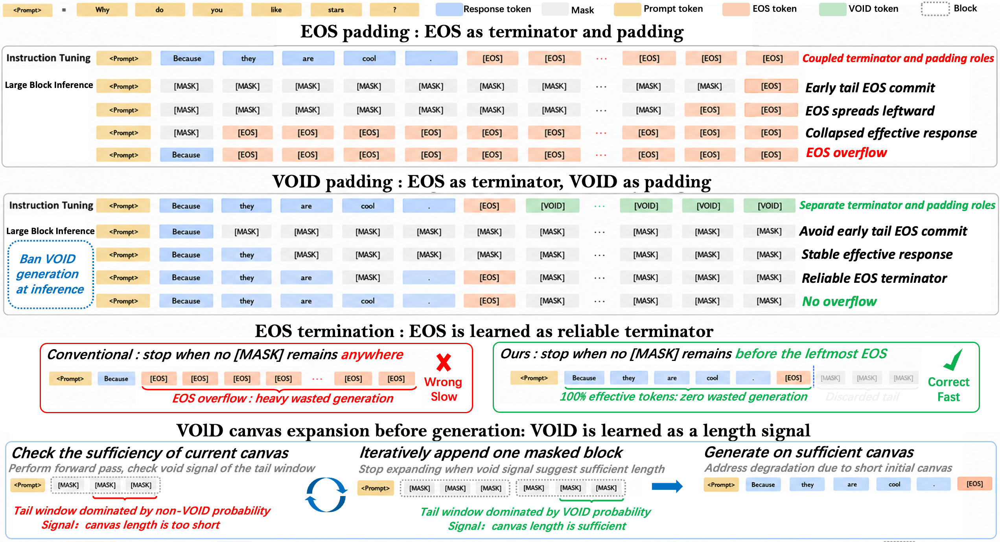

# VoidPadding : Let `[VOID]` handle padding in masked diffusion language models so that `[EOS]` can focus on semantic termination.

[](https://huggingface.co/datasets/akpon900/Tokenized_VoidPadding_Data)
[](https://huggingface.co/akpon900/dream-instruct-void)
[](https://huggingface.co/akpon900/llada-instruct-void)

<p align="center">
  
</p>

> **「假作真時真亦假，無為有處有還無。」 —《紅樓夢》太虛幻境**

In MDLMs, repeated padding can blur the boundary between emptiness and ending. This ambiguity can cause `[EOS]` overflow, a common failure mode where the model overproduces `[EOS]` under large-block decoding.

**VoidPadding** decouples padding from termination: `[VOID]` represents padded emptiness, while `[EOS]` marks semantic endings. By separating these signals, VoidPadding mitigates `[EOS]` overflow under large-block decoding, while using `[VOID]` as a learned length signal for adaptive canvas expansion.


## Method




**VoidPadding** uses `[VOID]` for padding and reserves `[EOS]` for semantic
termination in masked diffusion language models. At inference, `[VOID]`
generation is banned.

This gives VoidPadding three practical advantages:

- **Prevents EOS overflow.**
- **Makes `[EOS]` a reliable terminator,** enabling more efficient decoding with
  less wasted generation.
- **Enables VOID-based canvas expansion** by using the learned `[VOID]` signal
  to detect when the current response canvas is too short.

## Main Results

VoidPadding is the strongest fixed-length method on both instruction-tuned
backbones, and it also makes short-canvas expansion more reliable.

### Fixed-Length Robustness

#### LLaDA

| Task            | Method         |         B=64 |        B=128 |        B=512 |         Mean |
| --------------- | -------------- | -----------: | -----------: | -----------: | -----------: |
| GSM8K           | Original       | <u>76.80</u> |        70.96 |        28.43 |        58.73 |
| GSM8K           | RainbowPadding |        74.53 | <u>73.39</u> | <u>66.57</u> | <u>71.50</u> |
| GSM8K           | VoidPadding    |    **77.79** |    **78.39** |    **78.62** |    **78.27** |
| MATH500         | Original       | <u>39.60</u> | <u>37.60</u> |        16.60 |        31.27 |
| MATH500         | RainbowPadding |        33.20 |        34.00 |    **27.80** | <u>31.67</u> |
| MATH500         | VoidPadding    |    **40.60** |    **41.60** | <u>27.60</u> |    **36.60** |
| HumanEval       | Original       | <u>42.68</u> |    **43.90** |    **44.51** |    **43.70** |
| HumanEval       | RainbowPadding |    **43.90** | <u>43.29</u> |        35.98 |        41.06 |
| HumanEval       | VoidPadding    |        41.46 |        42.07 | <u>41.46</u> | <u>41.66</u> |
| MBPP            | Original       |        41.48 |        39.12 |        37.68 |        39.43 |
| MBPP            | RainbowPadding | <u>42.71</u> | <u>43.02</u> | <u>42.51</u> | <u>42.75</u> |
| MBPP            | VoidPadding    |    **44.66** |    **44.87** |    **44.97** |    **44.83** |
| Mean over tasks | Original       | <u>50.14</u> |        47.90 |        31.81 |        43.28 |
| Mean over tasks | RainbowPadding |        48.59 | <u>48.43</u> | <u>43.22</u> | <u>46.75</u> |
| Mean over tasks | VoidPadding    |    **51.13** |    **51.73** |    **48.16** |    **50.34** |


#### Dream

| Task            | Method         |         B=64 |        B=128 |        B=512 |         Mean |
| --------------- | -------------- | -----------: | -----------: | -----------: | -----------: |
| GSM8K           | Original       |        73.39 |        33.89 |        46.70 |        51.33 |
| GSM8K           | RainbowPadding | <u>79.15</u> | <u>77.63</u> | <u>52.16</u> | <u>69.65</u> |
| GSM8K           | VoidPadding    |    **80.44** |    **80.89** |    **78.09** |    **79.81** |
| MATH500         | Original       | <u>43.20</u> | <u>41.20</u> |        26.00 | <u>36.80</u> |
| MATH500         | RainbowPadding |        33.60 |        33.40 | <u>31.40</u> |        32.80 |
| MATH500         | VoidPadding    |    **44.00** |    **44.20** |    **45.20** |    **44.47** |
| HumanEval       | Original       |    **62.80** |    **60.37** |        18.90 |        47.36 |
| HumanEval       | RainbowPadding |    **62.80** |    **60.37** | <u>50.00</u> | <u>57.72</u> |
| HumanEval       | VoidPadding    | <u>59.76</u> | <u>59.15</u> |    **60.37** |    **59.76** |
| MBPP            | Original       |        41.00 |        31.00 |        30.00 |        34.00 |
| MBPP            | RainbowPadding | <u>56.00</u> | <u>54.80</u> | <u>47.80</u> | <u>52.87</u> |
| MBPP            | VoidPadding    |    **57.60** |    **58.00** |    **54.80** |    **56.80** |
| Mean over tasks | Original       |        55.10 |        41.62 |        30.40 |        42.37 |
| Mean over tasks | RainbowPadding | <u>57.89</u> | <u>56.55</u> | <u>45.34</u> | <u>53.26</u> |
| Mean over tasks | VoidPadding    |    **60.45** |    **60.56** |    **59.62** |    **60.21** |


### Fixed-Length Efficiency

Dream average NFE over \(B\in\{64,128,512\}\):

| Benchmark | VanillaStopping / RainbowPadding | VoidPadding | NFE Reduction |
| --- | ---: | ---: | ---: |
| GSM8K | 512.0 | 157.3 | 69.3% |
| MATH500 | 512.0 | 371.0 | 27.5% |
| HumanEval | 512.0 | 300.7 | 41.3% |
| MBPP | 512.0 | 78.7 | 84.6% |

### Short-Canvas Expansion

| Model | Method | GSM8K | MATH500 | HumanEval | MBPP | Mean |
| --- | --- | ---: | ---: | ---: | ---: | ---: |
| LLaDA | Fixed-64 | 60.20 | 26.80 | 29.27 | 41.27 | 39.38 |
| LLaDA | `rho-[EOS]` | 73.39 | 27.00 | 40.24 | 41.38 | 45.50 |
| LLaDA | Daedal | 79.38 | 37.40 | 44.51 | 41.79 | 50.77 |
| LLaDA | VoidExpansion | 78.32 | 39.60 | 42.07 | 45.38 | 51.34 |
| Dream | Fixed-64 | 53.22 | 22.80 | 43.90 | 49.00 | 42.23 |
| Dream | VoidExpansion | 79.08 | 44.00 | 60.98 | 57.40 | 60.37 |


## What Is Included

```text
.
├── main.py                         # LoRA SFT entrypoint
├── method/                         # Void/Rainbow/EOS padding training logic
├── eval/                           # LLaDA and Dream lm-eval wrappers
│   ├── dream/
│   ├── llada/
│   └── common/tasks/               # MATH500 and MBPP task configs/utilities
├── scripts/
│   ├── setup_env.sh                # One-command conda environment setup
│   ├── train/                      # SFT launch scripts
│   ├── merge/                      # Merge PEFT LoRA adapters into base models
│   └── eval/                       # Fixed-length and expansion evaluation
├── tokenizer_dream/                # Dream tokenizer assets used by eval/merge
├── tokenizer_llada/                # LLaDA tokenizer assets used by eval/merge
├── models/                         # Optional local adapter download directory
├── figures/                        # README figures
└── environment.yaml                # Conda environment
```

Runtime outputs are intentionally ignored by git:

- `model/` local training checkpoints
- `outputs/` merged test outputs, generated samples, SwanLab logs
- `logs/` runtime logs
- `evals_results/` benchmark outputs
- `models/` local adapter downloads
- `.hf_cache/` and Python caches

## Quick Start

Create the environment:

```bash
bash scripts/setup_env.sh
conda activate void
```

Use a custom environment name:

```bash
ENV_NAME=void-padding bash scripts/setup_env.sh
conda activate void-padding
```

The setup script creates or updates the conda environment and verifies the core
packages: PyTorch, Transformers, PEFT, and lm-eval.

HumanEval and MBPP post-processing is enabled by default in the eval scripts:
`postprocess_code.py` runs after HumanEval, and `postprocess_mbpp.py` runs
after MBPP. Set `POSTPROCESS_CODE=false` or `POSTPROCESS_MBPP=false` to skip
those steps.

## Data and Checkpoints

### Tokenized SFT Data

The tokenized SFT data is released at:

```text
akpon900/Tokenized_VoidPadding_Data
```

Expected structure after download:

```text
datasets/
├── tokenized_sft_dataset_dream_500000/
└── tokenized_sft_dataset_llada_500000/
```

Download with the Hugging Face CLI:

```bash
hf download akpon900/Tokenized_VoidPadding_Data \
  --repo-type dataset \
  --local-dir datasets
```

Then set `SFT_CACHE_DIR` before training:

```bash
# Dream training
export SFT_CACHE_DIR="$PWD/datasets/tokenized_sft_dataset_dream_500000"

# LLaDA training
export SFT_CACHE_DIR="$PWD/datasets/tokenized_sft_dataset_llada_500000"
```

### Base Models

VoidPadding adapters are LoRA adapters and must be used with their original base
models.

Dream base model:

```bash
hf download Dream-org/Dream-v0-Instruct-7B \
  --local-dir pretrained/Dream-v0-Instruct-7B
```

LLaDA base model:

```bash
hf download GSAI-ML/LLaDA-8B-Instruct \
  --local-dir pretrained/LLaDA-8B-Instruct
```

You can pass either the Hugging Face model id or the local download directory to
the merge/eval scripts:

```bash
BASE_MODEL="Dream-org/Dream-v0-Instruct-7B"
BASE_MODEL="pretrained/Dream-v0-Instruct-7B"
```

For base-model training experiments, use:

```bash
hf download Dream-org/Dream-v0-Base-7B \
  --local-dir pretrained/Dream-v0-Base-7B

hf download GSAI-ML/LLaDA-8B-Base \
  --local-dir pretrained/LLaDA-8B-Base
```

### Released LoRA Adapters

Released adapter repositories:

```text
akpon900/dream-instruct-rainbow
akpon900/dream-instruct-void
akpon900/llada-instruct-rainbow
akpon900/llada-instruct-void
```

Download them with:

```bash
hf download akpon900/dream-instruct-void \
  --local-dir models/dream-instruct-void

hf download akpon900/dream-instruct-rainbow \
  --local-dir models/dream-instruct-rainbow

hf download akpon900/llada-instruct-void \
  --local-dir models/llada-instruct-void

hf download akpon900/llada-instruct-rainbow \
  --local-dir models/llada-instruct-rainbow
```

If you download the adapters into `models/`, the local layout should be:

```text
models/
├── dream-instruct-void/
├── dream-instruct-rainbow/
├── llada-instruct-void/
└── llada-instruct-rainbow/
```

Each adapter repository contains:

- `README.md`
- `adapter_config.json`
- `adapter_model.safetensors`


## Merge LoRA Adapters

Evaluation expects merged full-model checkpoints. Merge a Dream adapter:

```bash
BASE_MODEL="Dream-org/Dream-v0-Instruct-7B" \
ADAPTER_PATH="models/dream-instruct-void" \
OUTPUT_DIR="outputs/merged/dream-instruct-void" \
bash scripts/merge/merge_dream_lora.sh
```

Merge a LLaDA adapter:

```bash
BASE_MODEL="GSAI-ML/LLaDA-8B-Instruct" \
ADAPTER_PATH="models/llada-instruct-void" \
OUTPUT_DIR="outputs/merged/llada-instruct-void" \
bash scripts/merge/merge_llada_lora.sh
```

Useful overrides:

```bash
TORCH_DTYPE=bfloat16
DEVICE=cuda          # auto, cpu, cuda, or cuda:N
TOKENIZER_PATH=/path/to/tokenizer
PYTHON=python
```

## Training

Training scripts require a tokenized SFT dataset cache. Download
`akpon900/Tokenized_VoidPadding_Data` first, then set:

```bash
export SFT_CACHE_DIR="$PWD/datasets/tokenized_sft_dataset_llada_500000"
# or
export SFT_CACHE_DIR="$PWD/datasets/tokenized_sft_dataset_dream_500000"
```

By default, scripts use public Hugging Face model ids. You can override the base
model with a local checkpoint:

```bash
export MODEL_PATH="/path/to/local/base/model"
```

Common smoke-test settings:

```bash
export NUM_PROCESSES=1
export BATCH_SIZE=1
export GRADIENT_ACCUMULATION_STEPS=1
export EPOCHS=1
export SAVE_AT_UPDATE_STEPS=1
export STOP_AT_UPDATE_STEP=1
export SWANLAB_MODE=disabled
```

VoidPadding SFT:

```bash
bash scripts/train/instruct/voidpadding_finetune_llada8b_instruct.sh
bash scripts/train/instruct/voidpadding_finetune_dream7b_instruct.sh
bash scripts/train/base/voidpadding_finetune_llada8b_base.sh
bash scripts/train/base/voidpadding_finetune_dream7b_base.sh
```

RainbowPadding and EOS-padding baselines:

```bash
bash scripts/train/instruct/rainbowpadding_finetune_llada8b_instruct.sh
bash scripts/train/instruct/rainbowpadding_finetune_dream7b_instruct.sh
bash scripts/train/base/rainbowpadding_finetune_llada8b_base.sh
bash scripts/train/base/rainbowpadding_finetune_dream7b_base.sh

bash scripts/train/base/eospadding_finetune_llada8b_base.sh
bash scripts/train/base/eospadding_finetune_dream7b_base.sh
```

Direct `main.py` usage:

```bash
accelerate launch --num_processes 1 --mixed_precision bf16 main.py \
  --method sft \
  --model_type llada_instruct \
  --model_name "GSAI-ML/LLaDA-8B-Instruct" \
  --sft_cache_dir "${SFT_CACHE_DIR}" \
  --pad_strategy void \
  --pad_num 1 \
  --save_at_update_steps 7000
```

Supported model types:

- `llada_base`
- `llada_instruct`
- `dream_base`
- `dream_instruct`

Supported padding strategies:

- `void`
- `rainbow`
- `eos`

## Evaluation

Use the one-key scripts below to reproduce the paper results end to end.

```bash
bash scripts/eval/fixed_length/llada/run_all_void.sh
bash scripts/eval/fixed_length/dream/run_all_void.sh
bash scripts/eval/fixed_length/llada/run_all_baseline.sh
bash scripts/eval/fixed_length/dream/run_all_baseline.sh
bash scripts/eval/expansion/llada/run_all_voidexpansion.sh
bash scripts/eval/expansion/dream/run_all_voidexpansion.sh
bash scripts/eval/expansion/llada/run_all_baseline.sh
bash scripts/eval/expansion/dream/run_all_baseline.sh
```

The fixed-length scripts cover `void`, `rainbow`, and `instruct` modes. The
expansion scripts cover `fixed_len`, `void_expand`, `daedal`, and `rho_eos` modes.

## Offline and Cluster Use

By default, scripts use the normal Hugging Face cache:

```text
${HOME}/.cache/huggingface
```

For offline clusters:

```bash
export HF_HOME="/path/to/hf/cache"
export HF_HUB_OFFLINE=1
export HF_DATASETS_OFFLINE=1
export TRANSFORMERS_OFFLINE=1
```

The training scripts do not hard-code dataset paths. Set `SFT_CACHE_DIR`
explicitly for your local tokenized data cache.


## Acknowledgements

This repository builds upon and adapts components from the following public projects:

- Evaluation code: [NVlabs/Fast-dLLM](https://github.com/NVlabs/Fast-dLLM)
- Training code: [quasar529/rainbow-padding](https://github.com/quasar529/rainbow-padding)
- DAEDAL baseline: [Li-Jinsong/DAEDAL](https://github.com/Li-Jinsong/DAEDAL)
- rho-EOS baseline: [yjyddq/rho-EOS](https://github.com/yjyddq/rho-EOS)

We thank the authors for releasing their code.

## Citation

If you use this repository, please cite the VoidPadding paper. A BibTeX entry
will be added after release.

```bibtex
@misc{voidpadding2026,
  title  = {VoidPadding: Let [VOID] Handle Padding in Masked Diffusion Language Models so that [EOS] Can Focus on Semantic Termination},
  author = {Chunyu Liu and Zhengyang Fan and Kaisen Yang and Alex Lamb},
  year   = {2026}
}
```
